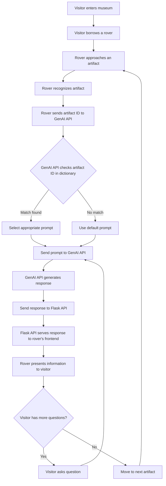

## AI Enhanced Musume guide with Rover

### Project Description

The "AI Enhanced Museum Guide with Rover" project aims to revolutionize the visitor experience in museums by integrating advanced artificial intelligence (AI) technology with a mobile robotic guide. This innovative solution seeks to make museum visits more interactive, educational, and enjoyable for diverse audiences.

### Flow Diagram

<!--  -->

## Idea
### AI-Based Solution for Museums

A solution can be built using generative AI technology to overcome the lack of appropriate information on artefacts and the limited interactivity of existing chatbots in museums.

### Solution Overview

A small robot is designed, which is moveable and contains a display. The robot follows the visitor throughout the museum and can provide detailed information about the artefacts, enhancing the visitor's experience.

### Features

1. **Interactive Experience**: 
   - The robot allows visitors to engage with it during their navigation pathways.
   - It includes a display for interactive communication and a microphone for voice input.

2. **Wireless Connectivity**: 
   - The robot is connected to the internet wirelessly, ensuring seamless communication.
   - Visitors can ask inquiries or request information about artefacts.

3. **AI-Powered Responses**: 
   - When a visitor asks a question, the microphone picks up the input, which is then sent to a server.
   - The server processes the request using a trained model and sends the response back to the robot.
   - The robot delivers the response to the visitor.

### Benefits

- **Enhanced Visitor Experience**: Visitors get detailed and interactive information about artefacts.
- **Automated Navigation and Information**: The robot can follow visitors and provide relevant content without the need for a museum guide.

## High Level Design
### Chit Chat: AI Chatbot for Museums

The ultimate goal is to design a chatbot called **"Chit Chat"** using **generative AI** and **robotics** for museums. The AI model within "Chit Chat" is trained to answer any questions about the artifacts. To achieve this, **Langchain** has been replaced with the **Groq API** to create the model, utilizing **OpenAI's GPT-LLM model** for natural language processing and interaction.

### Data Retrieval Using Vectorstore
For responding to visitor questions, this trained model will retrieve the necessary data or answers from a **vectorstore** containing information about museum artifacts. The **vectorstore** is populated with data about the artifacts, loaded from a structured text file or database. The role of the LLM (Language Learning Model) is to provide meaningful and accurate answers about the artifacts and maintain the flow of conversation with the visitor.

### Custom User Interface
For the user interface, instead of Gradio, a custom **chat interface** has been created using **HTML and CSS** for a more flexible and responsive design. Visitors can ask questions through the **voice recognition module**, which will convert speech to text and then provide that input to the model.

### Self-Propelled Robot
splayed on a **self-propelled robot** that can move alongside the visitor, constantly ready to answer their queries.

