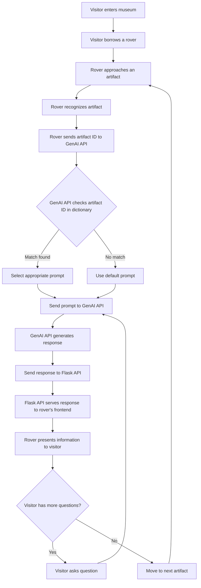

## AI Enhanced Musume guide with Rover

### Project Description

The "AI Enhanced Museum Guide with Rover" project aims to revolutionize the visitor experience in museums by integrating advanced artificial intelligence (AI) technology with a mobile robotic guide. This innovative solution seeks to make museum visits more interactive, educational, and enjoyable for diverse audiences.

### Flow Diagram

<!-- <script src="https://cdn.jsdelivr.net/npm/mermaid@8.4.8/dist/mermaid.min.js"></script> -->


## Idea
### AI-Based Solution for Museums

A solution can be built using generative AI technology to overcome the lack of appropriate information on artefacts and the limited interactivity of existing chatbots in museums.

### Solution Overview

A small robot is designed, which is moveable and contains a display. The robot follows the visitor throughout the museum and can provide detailed information about the artefacts, enhancing the visitor's experience.

### Features

1. **Interactive Experience**: 
   - The robot allows visitors to engage with it during their navigation pathways.
   - It includes a display for interactive communication and a microphone for voice input.

2. **Wireless Connectivity**: 
   - The robot is connected to the internet wirelessly, ensuring seamless communication.
   - Visitors can ask inquiries or request information about artefacts.

3. **AI-Powered Responses**: 
   - When a visitor asks a question, the microphone picks up the input, which is then sent to a server.
   - The server processes the request using a trained model and sends the response back to the robot.
   - The robot delivers the response to the visitor.

### Benefits

- **Enhanced Visitor Experience**: Visitors get detailed and interactive information about artefacts.
- **Automated Navigation and Information**: The robot can follow visitors and provide relevant content without the need for a museum guide.

## High Level Design
### Chit Chat: AI Chatbot for Museums

The ultimate goal is to design a chatbot called **"Chit Chat"** using **generative AI** and **robotics** for museums. The AI model within "Chit Chat" is trained to answer any questions about the artifacts. To achieve this, **Langchain** has been replaced with the **Groq API** to create the model, utilizing **OpenAI's GPT-LLM model** for natural language processing and interaction.

### Data Retrieval Using Vectorstore
For responding to visitor questions, this trained model will retrieve the necessary data or answers from a **vectorstore** containing information about museum artifacts. The **vectorstore** is populated with data about the artifacts, loaded from a structured text file or database. The role of the LLM (Language Learning Model) is to provide meaningful and accurate answers about the artifacts and maintain the flow of conversation with the visitor.

### Custom User Interface
For the user interface, instead of Gradio, a custom **chat interface** has been created using **HTML and CSS** for a more flexible and responsive design. Visitors can ask questions through the **voice recognition module**, which will convert speech to text and then provide that input to the model.

### Self-Propelled Robot
The entire application is displayed on a **self-propelled robot** that can move alongside the visitor, constantly ready to answer their queries.


## Technological Architecture


### LangChain: Connecting Local Data with LLMs
**LangChain** is a framework that helps developers create applications using **Large Language Models (LLMs)**. One of the most common uses of LangChain is to convert local data to a **vectorstore**, which allows LLMs to access and process local data more efficiently. After the data is connected to the LLM, it can be used to create various applications, such as:
- **Chatbots**
- **Question-answering systems**
- **Summarization tools**

### Groq API: Connecting to High-Performance Processing Systems
**Groq** provides an API that allows developers to connect their systems to Groq's high-performance **processing units**. The Groq API serves as a bridge between the developer's system and Groq’s processing resources. To use the API:
1. Developers need to create a **Groq account**.
2. Obtain an **API key**, which serves as a password granting access to Groq’s processing resources.
3. Once the connection is established, developers can send tasks to Groq's systems and receive processed results.

### ChromaDB: Vector Database for Storing Large Data
**ChromaDB** is a **vector database** used to store and query large amounts of data. To create a generative AI model using local data with ChromaDB:
1. The local data is first **converted into a vector format**.
2. Once in vector format, the data can be **stored in ChromaDB**.
This vector data can then be accessed by LLMs to process tasks such as answering questions or generating summaries.

### HTML and CSS: Building Interactive Web Applications
**HTML** and **CSS** are essential tools for creating interactive and visually appealing web applications. 
- **HTML** provides the structure of the web page, while **CSS** enhances the appearance and layout. 
- HTML is used to design the structure of the webpage, and then CSS is applied to style and format it, making the application more **user-friendly** and **responsive**.

### Robotics: Physical Architecture for AI Models
**Robotics** provides the physical machine architecture for the virtual AI model. In the case of the **Chit Chat Robotic Bot**:
- The bot is a **self-phased, human-following robot** equipped with a **microphone** and **sensors** to follow and listen to visitor commands.
- These commands are processed and integrated into the **pretrained AI model**, allowing the robot to display and answer visitor queries.

This integration of **LLMs, Groq's processing systems, ChromaDB, HTML/CSS, and robotics** results in a fully functional **Chit Chat Robotic Bot** capable of enhancing museum experiences by providing detailed and interactive responses to visitor questions.
## Why GenAI?
- Generative AI can be very interactive to the visitors and can enhance the experience of the visitors. 
- It can make conversations in a flow with the reference to the previous context. Overall, the knowledge about the artefacts can be delivered precisely.
- With the Gen-AI and Robotics Technology, this “Chit Chat” Robotic Bot will give the better visitors satisfaction with its effective responses of trained AI model. 

## RoverBot
The **Museum Management Rover** is an advanced robotic machine that moves among visitors at a museum, providing directions to artifacts of interest. The rover employs a **magnetic strip** embedded on the floor, **infrared sensors**, **light-dependent resistors (LDRs)**, and a **laser module** to detect moving black lines. Additionally, the rover aims laser beams towards the LDR mounted on the robot’s board to detect sudden light variations, which indicate the presence of artifacts.

## Features

- **Line Following**: The rover follows the black tape path using three IR sensors.
  
- **Artifact Detection**: LDRs are utilized to detect lasers on the artifacts over a specific duration.
  
- **Bluetooth Control**: A mobile application is implemented to enable Bluetooth control of the rover.
  
- **Continuous Laser Control**: The laser module can be used for various applications that require constant on-off cycles.


## Installation

1. Create a Virtual Environment:
```bash
python -m venv venv
```
2. Activate the Virtual Environment:

On Windows:
```sh
my_env\Scripts\activate
```
On macOS/Linux:
```sh
source my_env/bin/activate
```
3. Install Required Packages:
```bash
pip install -r requirements.txt
```
4. Open project file to run the project
```sh
python main.py
```

5. Open browser go to this url `http://127.0.0.1:5000` interact with this rover now❗


## Output of this project

* Rover are recoganize the artifact and send the details about the artifact to the Middleware flask API

  <iframe width="560" height="315" src="https://github.com/dev-dhanushkumar/Intel-Gen_AI-Hackathon/blob/main/static/rover_recoganization_video.mp4" frameborder="0" allowfullscreen></iframe>

