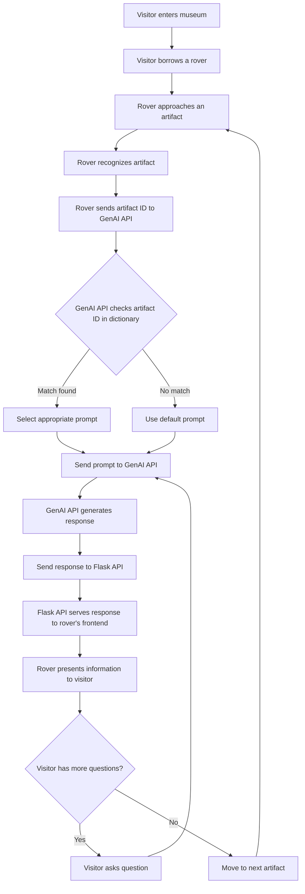

## AI Enhanced Musume guide with Rover

### Project Description

The "AI Enhanced Museum Guide with Rover" project aims to revolutionize the visitor experience in museums by integrating advanced artificial intelligence (AI) technology with a mobile robotic guide. This innovative solution seeks to make museum visits more interactive, educational, and enjoyable for diverse audiences.

### Flow Diagram

<!--  -->

